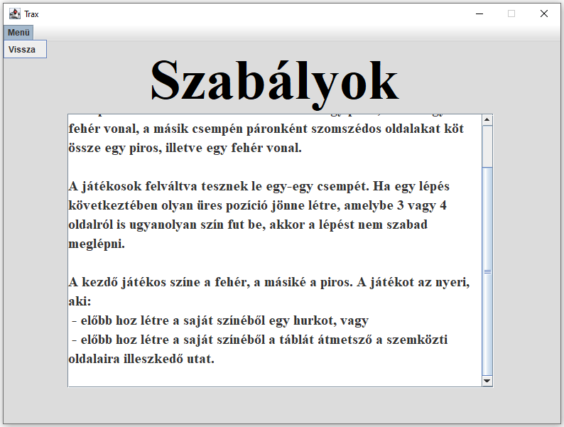

# Trax táblajáték

## Specifikáció

### Játék ismertetése, szabályai

A Trax egy két játékos által játszott stratégiai játék. A játéktér egy 8×8-as tábla, amelyet kétféle csempével kell kirakni. Az egyik csempének az átellenes oldalait köti össze egy piros, illetve egy fehér vonal, a másik csempén páronként szomszédos oldalakat köt össze egy piros, illetve egy fehér vonal. A játékosok felváltva tesznek le egy-egy csempét, a kivételeket alább listázom. 

             

 A kezdő játékos színe a fehér, a másiké a piros. A játékot az nyeri, aki előbb hoz létre a saját színéből vagy egy hurkot, vagy a táblát átmetsző a szemközti oldalaira illeszkedő vonallat. 

Speciális szabályok:

 *  Ha egy csempe lerakása által olyan üres pozíció jön létre, amelybe 2 oldalon ugyanolyan szín fut be, akkor azt kötelező (lépésen kívül) azonnal kitölteni a megfelelő csempével.
 *  Ha egy lépés következtében olyan üres pozíció jönne létre, amelybe 3 vagy 4 oldalról is ugyanolyan szín fut be, akkor a lépést nem szabad meglépni.

### Use-casek ismertetése

A funkciók a Java Swing grafikus felületén keresztül érhetőek el.

#### Új játék létrehozása
A menüben az Új játék opció kiválasztásával új játék hozható létre. Kezdéskor meg kell adni a játékosok neveit.

#### Aktuális játék játszása
A játok során a játokosok felváltva csempéket helyezhetnek le. A program minden lépésnél ellenőrzi, hogy szabályos-e a lépés, illetve, hogy véget ért-e a játék az utolsó lépéssel.

#### Aktuális játék mentése
Játék közben a Mentés opció kiválasztásával elmenthető a játék aktuális állása

#### Korábbi játék visszatöltése
A Játék visszaállítása opciót választva kiválaszthatjuk a visszaállítani kívánt játékot, és ennek a mentés előtti állapotából folytathatjuk azt.

### Alkalmazott technológiák

* A program fejlesztése a Java Platform 8-as verziójában történik.
* A grafikus megjelenítés a Java Swing API-t felhasználva történik.
* Az alkalmazás az Objektum orientált szoftvertervezési elvek szerint kerül implementálásra.
* A program támogatja a JUnit alapú tesztelést.

## Adatszerkezet
Ez a fejezet csak az osztályok fő funkcióját mutatja be, illetve az osztálydiagramokat tartalmazza. Az egyes tagfüggvények működései a javadocs dokumentációban találhatóak.

<b> Az összes osztályt tartalmazó osztálydiagramm </b>

<b> A játékot megvalósító osztályokat ábrázoló osztálydiagramm </b> (Testosztályok nélkül).

### A program logikáját és grafikus megjelenítését végző osztályok
##### Main
A Trax játék belépési pontja megvalósító Main osztály.
##### Menu
A játék főmenüjét megvalósító grafikus osztály, amely a JFrame osztályból származik le. Ebből az ablakból érhető el a játékszabályzat, a játékosnevek beállítás, az új játék kezdése ileltve a korábbi játék folytatása funkciók.
##### Rules
A játék szabályait megjelenítő grafikus osztály, amely a JFrame-ből származik le, és egy gördíthető szövegdobozban jeleníti meg a játék szabályzatát.
##### ChooseNames
A játékosnevek beállításáért felelős grafikus osztály, amely a JFrame-ből származik le.
##### GameBoard
A játék logikáját megvalósító és a pályát megjelenítő grafikus osztály. Tartalmazza a pályát, a játékosok névkártyáit illetve az új csempe választására alkalmas gombokat.
##### GameData
Az aktuális játék mentéséhez, korábbi játék visszaállításához a szerializációt megvalósító és kezelő osztály.
##### Player
A játékosakat reprezentáló osztály.
##### Tile
A játék mezőit megjelenítő grafikus elemek absztrakt ősosztálya. Belőle származik le az EmptyTile és a PlacedTile osztályok. Az EmptyTile az üres mezőket reprezentáló grafikus osztály. A PlacedTile a lerakott csempéket reprezentáló grafikus osztály, belőle származik le további két konkrét csempe osztály. A CurvedTile az egymást nem metsző, görbe vonalakkal borított csempéket reprezentáló osztály, amely a PlacedTile osztályból származik le. A StraightTile pedig az egymást keresztező vonalakkal borított csempéket reprezentáló osztály, amely a PlacedTile osztályból származik le.
##### Serializer
Sablon paraméterrel létrehozott osztály a szerializálás végrehajtásához.

### A program tesztelését végző osztályok
##### GameDataTest
A GamaData osztály működését tesztelő osztály.
##### GameBoardTest
A GamaData osztály működését tesztelő osztály.
##### PlayerTest
A Player osztály getName és getColor tagfüggvényeit tesztelő osztály.
##### IsEmptyTest
A Tile ősosztályból származó osztályok isEmpty tagfüggvény felüldefiniálásait tesztelő osztály.
##### PlacedTileTest
A Tile ősosztályból származó PlacedTile osztályok getTileX és getTileY tagfüggvényeit tesztelő osztály.
##### CurvedTileTest
A PlacedTile ősosztályból származó CurvedTile osztály oldalszín getter tagfüggvényeinek felüldefiniálásait tesztelő osztály.
##### StraightTileTest
A PlacedTile ősosztályból származó StraightTile osztály oldalszín getter tagfüggvényeinek felüldefiniálásait tesztelő osztály.

## Felhasználói kézikönyv

### Főmenü

 A játék indításakor a főmenü ablak nyílik meg. Itt 4 opció közül választhatunk, a 4 gomb valamelyikének megnyomásával. 

 * <b>Játékszabály: </b> Megnyit egy új ablakot, amelyen a játékszabályok olvashatóak.
 *  <b>Játékosnevek megadása: </b> Megnyit egy új ablakot, amelyben megadhatjuk, hogy milyen néven szeretnénk játszani.
 *  <b>Korábbi játék folytatása: </b> Megnyit egy új ablakot, amelyben amennyiben van ilyen játékosnevekkel elmentett játék visszatölti annak tartalmát, ha nincs akkor egy új játékot kezd.
 *  <b>Új játék kezdése: </b> Megnyit egy új ablakot, amelyben kirajzol egy üres pályát a beállított játékosnevekkel.
 

### Szabályok megtekintése

 A játékszabályok a középső görgethető grafikus szövegterületen olvasható. A játékszabályok alaposmegismerése után a bal felső sarokban található legördülő menübár "Vissza" elemére kattintva juthatunk vissza a főmenübe. 

#### Játékosnevek megadása

 Ebben az ablakban adhatjuk meg a játékosok neveit. Ha korábbi játékot/játékosneveket szeretnénk használni, akkor az alsó panelben egy legördülő listából kiválaszthatjuk, hogy mely korábbi játékot szeretnénk visszatölteni. Az OK gomb lenyomása után a játékosok nevei beíródnak a felső panel névmezőibe. a nem korábbi játékot szeretnénk visszatölteni, akkor a felső panelben adhatjuk meg a játékosok neveit. A végleges játékosnevek beírása után az OK gombok lenyomásával adjuk át a játékosok neveit a programot kezelő Menu osztálynak.

 A főmenübe történő visszalépés szintén bal felső sarokban található legördülő menübár "Vissza" elemére kattintva lehetséges. 

### A játék menete

 A játék során a játékosok felváltva helyezhetnek le csempéket a következő módon. Először az alsó 6 különböző csempét tartalmazó panelen a kívánt csempére kattintva kiválaszthatják, hogy milyen csempét szeretnének lehelyezni, majd a tábla megfelelő mezőjére kattintva tehetik le ezt a csempét. Amennyiben a lépés szabálytalan lenne, úgy a program nem engedélyezi a lépést, és erről hibaüzenetben tájékoztatja a játékosokat.

 Ha a játék véget ér, akkor a program kikapcsolja az új csempe kiválasztásának opcióját, és kiírja a játék eredményét. (Győztes neve vagy döntetlen.)

 A főmenübe történő visszalépés szintén bal felső sarokban található legördülő menübár használatával lehetséges. A "Mentés" gombra kattintva a pálya tartalma elmentésre kerül, az később ugyanebből az állapotból folytatható lesz. A "Befejezés" gombra kattintva a pálya tartalma törlődik. 

